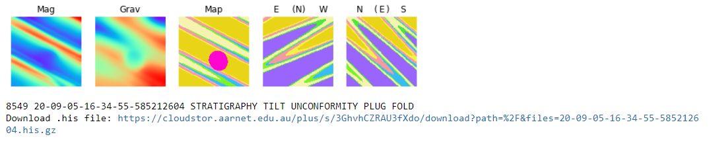

# noddyverse 

C Code to generate random Noddy models, together with example notebook to visualise randomly selected models from 1M model suite:

   
Noddy Windows installer (non-randomiser version) is available at the <a href="http://tectonique.net/noddy" target="_blank">Noddy Site</a>
   

